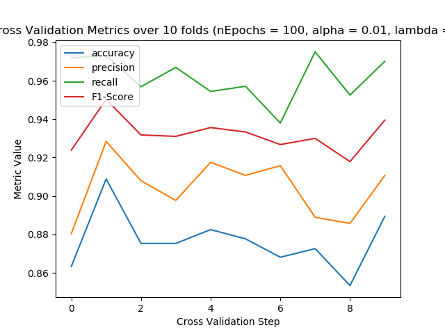

# PA2: Logistic Regression

**Author:** Justin Shapiro

**Date:** February 14th, 2018

**Class:** CSCI-5800 (Special Topics: Machine Learning)

### Description
This assignment implements from scratch the Logistic Regression algorithm used in Machine Learning classification problems. Python with its powerful NumPy library is used to write a logistic regressor (classifier) that uses a bank dataset with information from 45,211 clients to predict whether a client is going to subscribe a term deposit in the bank.

### System Information
- **Programming Language:** Python 3.6.4 (64-bit) (*not* using Anaconda)
- **Operating System:** Windows 10 Pro
- **Architecture:**: 64-bit, Intel Xeon CPU E3-1270 @ 3.80GHz

### Required Packages
- [scikit-learn 0.19.1](https://pypi.python.org/pypi/scipy/1.0.0) (for preprocessing and normalization)
- [SciPy 1.0.0](https://pypi.python.org/pypi/scipy/1.0.0) (required for scikit-learn to run)
- [NumPy 1.14.0](https://pypi.python.org/pypi/numpy/1.14.0) (for linear algebra)
- [Pandas 0.22.0](https://pypi.python.org/pypi/pandas/0.22.0) (for reading data)
- [Matplotlib 2.1.2](https://pypi.python.org/pypi/matplotlib) (for plotting results)

### Compile & Run
Make sure you run a **64-bit version** of Python 3.3 or greater version at 64-bits. The program will not work with a
32-bit version of Python because of the vectorization used to speed-up computation. Because vectorization is used,
there is often more than 4GB of RAM required to carry out operations on large matrices. Analytical vectorization is used
to find `w`, rather than a commonly-used iterative solution known as gradient descent.

Once a 64-bit version of Python 3.3 or greater is install along with the required packages listed above, start the
program with the script:

`python logistic_regression.py`

## Problems

Problems 1 - 8 are answered via console output. In other words, the answer to each problem is answered during runtime. Therefore, the Python program acts as formal verification of the answers.

1. _Load the data into memory. Then, convert each of the categorical variables into numerical._
   
   **Program output**:
   ```
   Problem #1:
   ---------------
   The bank dataset has 45211 samples with 16 attributes per sample
       -> There are 5289 "yes" (1) targets and 39922 "no" (0) targets
   The bank-small dataset has 8334 samples with 16 attributes per sample
       -> There are 1000 "yes" (1) targets and 7334 "no" (0) targets
   ```
   
2. _Now, implement logistic regression with SSE as loss function the cost function from class 2/5/2018. You need to solve it using the batch "Gradient Descent" algorithm. For the convergence test, choose option 1 with different nEpoch parameters from {100, 500, 1000}._
   
   **Program output**:
   ```
   Problem #2:
   ---------------
   There is nothing to output here.
   See Problem 3 for the output of the Logistic Regression function built in this step
   ```
   
3. _Split the data randomly into two equal parts, containing 50% of the samples which will be used for training, and a test set containing the remaining 50% of the samples. [Alternatively, you can use the training & test splits provided above that preserves density of "yes" and "no" targets] [ bank-small-train.csvPreview the document , bank-small-test.csvPreview the document]_

	_a. Perform a 10-fold cross-validation to classify the training dataset using logistic regression you developed in step 2. Please report accuracy, precision, recall, F1-score in each step of cross-validation and also report the average of these individual metrics. This is going to be the training performance._
	
	_b. Now perform logistic regression on the entire training set, and evaluate the model on the test set. Please report accuracy, precision, recall, F1-score. This is going to be the test performance._
	
	_c. Repeat this step with 3 different learning rates, α = { 0.01 , 0.1 , 1 } , and report the training and test performances._
	
	**Program output**:
    ```
    Problem #3:
    ---------------
	Set from bank.csv has 22605 (~50%) training samples and 22606 (~50%) testing samples
	Set from bank-small.csv has 4167 (~50%) training samples and 4167 (~50%) testing samples
	Set from provided CSVs have 4167 (~100%) training samples and 4167 (~100%) testing samples
	Page | 3
	For alpha=0.01:
		-> For nEpochs=100:
			-> CV Step 1: accuracy=0.7937649880095923 | precision=0.8552631578947368 | recall=0.9129213483146067 | F1-score=0.8831521739130435
			-> CV Step 2: accuracy=0.8129496402877698 | precision=0.8912466843501327 | recall=0.900804289544236 | F1-score=0.8960000000000001
			-> CV Step 3: accuracy=0.8249400479616307 | precision=0.8880208333333334 | recall=0.9191374663072777 | F1-score=0.9033112582781457
			-> CV Step 4: accuracy=0.815347721822542 | precision=0.8685567010309279 | recall=0.928374655647383 | F1-score=0.8974700399467378
			-> CV Step 5: accuracy=0.8393285371702638 | precision=0.900523560209424 | recall=0.9222520107238605 | F1-score=0.9112582781456953
			-> CV Step 6: accuracy=0.8081534772182254 | precision=0.884514435695538 | recall=0.903485254691689 | F1-score=0.8938992042440318
			-> CV Step 7: accuracy=0.815347721822542 | precision=0.8888888888888888 | recall=0.9056603773584906 | F1-score=0.897196261682243
			-> CV Step 8: accuracy=0.7908653846153846 | precision=0.8605263157894737 | recall=0.9058171745152355 | F1-score=0.8825910931174089
			-> CV Step 9: accuracy=0.7860576923076923 | precision=0.8586666666666667 | recall=0.8994413407821229 | F1-score=0.878581173260573
			-> CV Step 10: accuracy=0.8221153846153846 | precision=0.8828125 | recall=0.9211956521739131 | F1-score=0.901595744680851
			-> Average of CV metrics: accuracy=0.8108870595831028 | precision=0.8779019743859122 | recall=0.9119089570058815 | F1-score=0.894505522726873
			-> Test Performance: accuracy=0.8005759539236861 | precision=0.8795503211991434 | recall=0.8961003545132261 | F1-score=0.8877482101850601
		-> For nEpochs=500:
			-> CV Step 1: accuracy=0.8033573141486811 | precision=0.8549222797927462 | recall=0.9269662921348315 | F1-score=0.889487870619946
			-> CV Step 2: accuracy=0.8225419664268585 | precision=0.8883116883116883 | recall=0.9168900804289544 | F1-score=0.9023746701846965
			-> CV Step 3: accuracy=0.829736211031175 | precision=0.8886010362694301 | recall=0.9245283018867925 | F1-score=0.9062087186261559
			-> CV Step 4: accuracy=0.4412470023980815 | precision=0.9710144927536232 | recall=0.3691460055096419 | F1-score=0.5349301397205589
			-> CV Step 5: accuracy=0.8345323741007195 | precision=0.8937823834196891 | recall=0.9249329758713136 | F1-score=0.909090909090909
			-> CV Step 6: accuracy=0.829736211031175 | precision=0.8871794871794871 | recall=0.9276139410187667 | F1-score=0.9069462647444299
			-> CV Step 7: accuracy=0.45083932853717024 | precision=0.9733333333333334 | recall=0.3935309973045822 | F1-score=0.5604606525911707
			-> CV Step 8: accuracy=0.7956730769230769 | precision=0.8612565445026178 | recall=0.9113573407202216 | F1-score=0.8855989232839838
			-> CV Step 9: accuracy=0.7836538461538461 | precision=0.8526315789473684 | recall=0.9050279329608939 | F1-score=0.8780487804878049
			-> CV Step 10: accuracy=0.8341346153846154 | precision=0.8823529411764706 | recall=0.9375 | F1-score=0.9090909090909091
			-> Average of CV metrics: accuracy=0.7425451946135398 | precision=0.8953385765686456 | recall=0.8137493867836 | F1-score=0.8282237838440564
			-> Test Performance: accuracy=0.8183345332373411 | precision=0.8783151326053042 | recall=0.9211889828197437 | F1-score=0.8992413150539066
		-> For nEpochs=1000:
			-> CV Step 1: accuracy=0.841726618705036 | precision=0.8756476683937824 | recall=0.949438202247191 | F1-score=0.9110512129380054
			-> CV Step 2: accuracy=0.8345323741007195 | precision=0.9 | recall=0.9168900804289544 | F1-score=0.9083665338645418
			-> CV Step 3: accuracy=0.8441247002398081 | precision=0.9026315789473685 | recall=0.9245283018867925 | F1-score=0.9134487350199734
			-> CV Step 4: accuracy=0.829736211031175 | precision=0.8782383419689119 | recall=0.9338842975206612 | F1-score=0.9052069425901201
			-> CV Step 5: accuracy=0.8513189448441247 | precision=0.9102902374670184 | recall=0.9249329758713136 | F1-score=0.9175531914893618
			-> CV Step 6: accuracy=0.8249400479616307 | precision=0.8886010362694301 | recall=0.9195710455764075 | F1-score=0.9038208168642952
			-> CV Step 7: accuracy=0.8249400479616307 | precision=0.8941798941798942 | recall=0.9110512129380054 | F1-score=0.9025367156208279
			-> CV Step 8: accuracy=0.8125 | precision=0.8694516971279374 | recall=0.9224376731301939 | F1-score=0.8951612903225807
			-> CV Step 9: accuracy=0.8317307692307693 | precision=0.8730569948186528 | recall=0.9413407821229051 | F1-score=0.9059139784946237
			-> CV Step 10: accuracy=0.8509615384615384 | precision=0.8963730569948186 | recall=0.9402173913043478 | F1-score=0.9177718832891246
			-> Average of CV metrics: accuracy=0.8346511252536433 | precision=0.8888470506167814 | recall=0.9284291963026773 | F1-score=0.9080831300493454
			-> Test Performance: accuracy=0.8360931125509959 | precision=0.8899634082592787 | recall=0.9285519498227434 | F1-score=0.9088482583744829
	For alpha=0.1:
		-> For nEpochs=100:
			-> CV Step 1: accuracy=0.7937649880095923 | precision=0.8552631578947368 | recall=0.9129213483146067 | F1-score=0.8831521739130435
			-> CV Step 2: accuracy=0.8129496402877698 | precision=0.8912466843501327 | recall=0.900804289544236 | F1-score=0.8960000000000001
			-> CV Step 3: accuracy=0.8249400479616307 | precision=0.8880208333333334 | recall=0.9191374663072777 | F1-score=0.9033112582781457
			-> CV Step 4: accuracy=0.815347721822542 | precision=0.8685567010309279 | recall=0.928374655647383 | F1-score=0.8974700399467378
			-> CV Step 5: accuracy=0.8393285371702638 | precision=0.900523560209424 | recall=0.9222520107238605 | F1-score=0.9112582781456953
			-> CV Step 6: accuracy=0.8081534772182254 | precision=0.884514435695538 | recall=0.903485254691689 | F1-score=0.8938992042440318
			-> CV Step 7: accuracy=0.815347721822542 | precision=0.8888888888888888 | recall=0.9056603773584906 | F1-score=0.897196261682243
			-> CV Step 8: accuracy=0.7908653846153846 | precision=0.8605263157894737 | recall=0.9058171745152355 | F1-score=0.8825910931174089
			-> CV Step 9: accuracy=0.7860576923076923 | precision=0.8586666666666667 | recall=0.8994413407821229 | F1-score=0.878581173260573
			-> CV Step 10: accuracy=0.8221153846153846 | precision=0.8828125 | recall=0.9211956521739131 | F1-score=0.901595744680851
			-> Average of CV metrics: accuracy=0.8108870595831028 | precision=0.8779019743859122 | recall=0.9119089570058815 | F1-score=0.894505522726873
			-> Test Performance: accuracy=0.8003359731221502 | precision=0.8795180722891566 | recall=0.8958276520316335 | F1-score=0.8875979465009456
		-> For nEpochs=500:
			-> CV Step 1: accuracy=0.8033573141486811 | precision=0.8549222797927462 | recall=0.9269662921348315 | F1-score=0.889487870619946
			-> CV Step 2: accuracy=0.8225419664268585 | precision=0.8883116883116883 | recall=0.9168900804289544 | F1-score=0.9023746701846965
			-> CV Step 3: accuracy=0.829736211031175 | precision=0.8886010362694301 | recall=0.9245283018867925 | F1-score=0.9062087186261559
			-> CV Step 4: accuracy=0.4412470023980815 | precision=0.9710144927536232 | recall=0.3691460055096419 | F1-score=0.5349301397205589
			-> CV Step 5: accuracy=0.8345323741007195 | precision=0.8937823834196891 | recall=0.9249329758713136 | F1-score=0.909090909090909
			-> CV Step 6: accuracy=0.829736211031175 | precision=0.8871794871794871 | recall=0.9276139410187667 | F1-score=0.9069462647444299
			-> CV Step 7: accuracy=0.8201438848920863 | precision=0.8854166666666666 | recall=0.9164420485175202 | F1-score=0.9006622516556292
			-> CV Step 8: accuracy=0.7956730769230769 | precision=0.8612565445026178 | recall=0.9113573407202216 | F1-score=0.8855989232839838
			-> CV Step 9: accuracy=0.7836538461538461 | precision=0.8526315789473684 | recall=0.9050279329608939 | F1-score=0.8780487804878049
			-> CV Step 10: accuracy=0.8341346153846154 | precision=0.8823529411764706 | recall=0.9375 | F1-score=0.9090909090909091
			-> Average of CV metrics: accuracy=0.7794756502490315 | precision=0.8865469099019787 | recall=0.8660404919048936 | F1-score=0.8622439437505023
			-> Test Performance: accuracy=0.8183345332373411 | precision=0.8783151326053042 | recall=0.9211889828197437 | F1-score=0.8992413150539066
		-> For nEpochs=1000:
			-> CV Step 1: accuracy=0.841726618705036 | precision=0.8756476683937824 | recall=0.949438202247191 | F1-score=0.9110512129380054
			-> CV Step 2: accuracy=0.8345323741007195 | precision=0.9 | recall=0.9168900804289544 | F1-score=0.9083665338645418
			-> CV Step 3: accuracy=0.841726618705036 | precision=0.8961038961038961 | recall=0.9299191374663073 | F1-score=0.9126984126984128
			-> CV Step 4: accuracy=0.8321342925659473 | precision=0.8865435356200527 | recall=0.9256198347107438 | F1-score=0.9056603773584905
			-> CV Step 5: accuracy=0.8489208633093526 | precision=0.9428571428571428 | recall=0.8847184986595175 | F1-score=0.9128630705394192
			-> CV Step 6: accuracy=0.8249400479616307 | precision=0.8886010362694301 | recall=0.9195710455764075 | F1-score=0.9038208168642952
			-> CV Step 7: accuracy=0.8249400479616307 | precision=0.8941798941798942 | recall=0.9110512129380054 | F1-score=0.9025367156208279
			-> CV Step 8: accuracy=0.8125 | precision=0.8694516971279374 | recall=0.9224376731301939 | F1-score=0.8951612903225807
			-> CV Step 9: accuracy=0.8317307692307693 | precision=0.8730569948186528 | recall=0.9413407821229051 | F1-score=0.9059139784946237
			-> CV Step 10: accuracy=0.8509615384615384 | precision=0.8963730569948186 | recall=0.9402173913043478 | F1-score=0.9177718832891246
			-> Average of CV metrics: accuracy=0.8344113171001661 | precision=0.8922814922365607 | recall=0.9241203858584572 | F1-score=0.9075844291990321
			-> Test Performance: accuracy=0.8360931125509959 | precision=0.8899634082592787 | recall=0.9285519498227434 | F1-score=0.9088482583744829
	For alpha=1:
		-> For nEpochs=100:
			-> CV Step 1: accuracy=0.7937649880095923 | precision=0.8552631578947368 | recall=0.9129213483146067 | F1-score=0.8831521739130435
			-> CV Step 2: accuracy=0.8129496402877698 | precision=0.8912466843501327 | recall=0.900804289544236 | F1-score=0.8960000000000001
			Page | 4
			-> CV Step 3: accuracy=0.8249400479616307 | precision=0.8880208333333334 | recall=0.9191374663072777 | F1-score=0.9033112582781457
			-> CV Step 4: accuracy=0.815347721822542 | precision=0.8685567010309279 | recall=0.928374655647383 | F1-score=0.8974700399467378
			-> CV Step 5: accuracy=0.8393285371702638 | precision=0.900523560209424 | recall=0.9222520107238605 | F1-score=0.9112582781456953
			-> CV Step 6: accuracy=0.8081534772182254 | precision=0.884514435695538 | recall=0.903485254691689 | F1-score=0.8938992042440318
			-> CV Step 7: accuracy=0.815347721822542 | precision=0.8888888888888888 | recall=0.9056603773584906 | F1-score=0.897196261682243
			-> CV Step 8: accuracy=0.7908653846153846 | precision=0.8605263157894737 | recall=0.9058171745152355 | F1-score=0.8825910931174089
			-> CV Step 9: accuracy=0.7860576923076923 | precision=0.8586666666666667 | recall=0.8994413407821229 | F1-score=0.878581173260573
			-> CV Step 10: accuracy=0.8221153846153846 | precision=0.8828125 | recall=0.9211956521739131 | F1-score=0.901595744680851
			-> Average of CV metrics: accuracy=0.8108870595831028 | precision=0.8779019743859122 | recall=0.9119089570058815 | F1-score=0.894505522726873
			-> Test Performance: accuracy=0.8003359731221502 | precision=0.8795180722891566 | recall=0.8958276520316335 | F1-score=0.8875979465009456
		-> For nEpochs=500:
			-> CV Step 1: accuracy=0.8033573141486811 | precision=0.8549222797927462 | recall=0.9269662921348315 | F1-score=0.889487870619946
			-> CV Step 2: accuracy=0.8225419664268585 | precision=0.8883116883116883 | recall=0.9168900804289544 | F1-score=0.9023746701846965
			-> CV Step 3: accuracy=0.49640287769784175 | precision=0.96 | recall=0.4528301886792453 | F1-score=0.6153846153846154
			-> CV Step 4: accuracy=0.8249400479616307 | precision=0.8756476683937824 | recall=0.931129476584022 | F1-score=0.9025367156208278
			-> CV Step 5: accuracy=0.8345323741007195 | precision=0.8937823834196891 | recall=0.9249329758713136 | F1-score=0.909090909090909
			-> CV Step 6: accuracy=0.829736211031175 | precision=0.8871794871794871 | recall=0.9276139410187667 | F1-score=0.9069462647444299
			-> CV Step 7: accuracy=0.8201438848920863 | precision=0.8854166666666666 | recall=0.9164420485175202 | F1-score=0.9006622516556292
			-> CV Step 8: accuracy=0.7956730769230769 | precision=0.8612565445026178 | recall=0.9113573407202216 | F1-score=0.8855989232839838
			-> CV Step 9: accuracy=0.7836538461538461 | precision=0.8526315789473684 | recall=0.9050279329608939 | F1-score=0.8780487804878049
			-> CV Step 10: accuracy=0.8341346153846154 | precision=0.8823529411764706 | recall=0.9375 | F1-score=0.9090909090909091
			-> Average of CV metrics: accuracy=0.7845116214720532 | precision=0.8841501238390517 | recall=0.8750690276915769 | F1-score=0.8699221910163752
			-> Test Performance: accuracy=0.8183345332373411 | precision=0.8783151326053042 | recall=0.9211889828197437 | F1-score=0.8992413150539066
		-> For nEpochs=1000:
			-> CV Step 1: accuracy=0.841726618705036 | precision=0.8756476683937824 | recall=0.949438202247191 | F1-score=0.9110512129380054
			-> CV Step 2: accuracy=0.8345323741007195 | precision=0.9 | recall=0.9168900804289544 | F1-score=0.9083665338645418
			-> CV Step 3: accuracy=0.8441247002398081 | precision=0.9026315789473685 | recall=0.9245283018867925 | F1-score=0.9134487350199734
			-> CV Step 4: accuracy=0.8273381294964028 | precision=0.875968992248062 | recall=0.9338842975206612 | F1-score=0.904
			-> CV Step 5: accuracy=0.513189448441247 | precision=0.9722222222222222 | recall=0.4691689008042895 | F1-score=0.6329113924050632
			-> CV Step 6: accuracy=0.8249400479616307 | precision=0.8886010362694301 | recall=0.9195710455764075 | F1-score=0.9038208168642952
			-> CV Step 7: accuracy=0.8225419664268585 | precision=0.889763779527559 | recall=0.9137466307277629 | F1-score=0.9015957446808511
			-> CV Step 8: accuracy=0.8125 | precision=0.8694516971279374 | recall=0.9224376731301939 | F1-score=0.8951612903225807
			-> CV Step 9: accuracy=0.8317307692307693 | precision=0.8730569948186528 | recall=0.9413407821229051 | F1-score=0.9059139784946237
			-> CV Step 10: accuracy=0.8509615384615384 | precision=0.8963730569948186 | recall=0.9402173913043478 | F1-score=0.9177718832891246
			-> Average of CV metrics: accuracy=0.800358559306401 | precision=0.8943717026549832 | recall=0.8831223305749505 | F1-score=0.8794041587879061
			-> Test Performance: accuracy=0.8360931125509959 | precision=0.8899634082592787 | recall=0.9285519498227434 | F1-score=0.9088482583744829
   ```
   
4. _Scale the features of the dataset using Min-Max scaling to [0,1] range, and repeat step 3. Please do not scale the y feature. And also do not scale the added column for the bias term having all 1s (i.e., x0=1 column)_
	
	**Program output**:
	```
	For alpha=0.01:
		-> For nEpochs=100:
			-> CV Step 1: accuracy=0.7841726618705036 | precision=0.9554794520547946 | recall=0.7837078651685393 | F1-score=0.861111111111111
			-> CV Step 2: accuracy=0.894484412470024 | precision=0.9002433090024331 | recall=0.9919571045576407 | F1-score=0.9438775510204083
			-> CV Step 3: accuracy=0.894484412470024 | precision=0.8939759036144578 | recall=1.0 | F1-score=0.9440203562340967
			-> CV Step 4: accuracy=0.5611510791366906 | precision=1.0 | recall=0.49586776859504134 | F1-score=0.6629834254143646
			-> CV Step 5: accuracy=0.513189448441247 | precision=0.9941860465116279 | recall=0.4584450402144772 | F1-score=0.6275229357798164
			-> CV Step 6: accuracy=0.894484412470024 | precision=0.8983050847457628 | recall=0.9946380697050938 | F1-score=0.9440203562340967
			-> CV Step 7: accuracy=0.9088729016786571 | precision=0.9172932330827067 | recall=0.9865229110512129 | F1-score=0.9506493506493506
			-> CV Step 8: accuracy=0.8798076923076923 | precision=0.9307479224376731 | recall=0.9307479224376731 | F1-score=0.930747922437673
			-> CV Step 9: accuracy=0.8605769230769231 | precision=0.8605769230769231 | recall=1.0 | F1-score=0.9250645994832042
			-> CV Step 10: accuracy=0.8846153846153846 | precision=0.8846153846153846 | recall=1.0 | F1-score=0.9387755102040816
			-> Average of CV metrics: accuracy=0.8075839328537171 | precision=0.9235423259141763 | recall=0.8641886681729678 | F1-score=0.8728773118568203
			-> Test Performance: accuracy=0.7532997360211183 | precision=0.9567324333679473 | recall=0.7537496591218981 | F1-score=0.8431970713849909
		-> For nEpochs=500:
			-> CV Step 1: accuracy=0.8657074340527577 | precision=0.9166666666666666 | recall=0.9269662921348315 | F1-score=0.9217877094972067
			-> CV Step 2: accuracy=0.894484412470024 | precision=0.8963855421686747 | recall=0.9973190348525469 | F1-score=0.9441624365482234
			-> CV Step 3: accuracy=0.8920863309352518 | precision=0.8918269230769231 | recall=1.0 | F1-score=0.9428208386277002
			-> CV Step 4: accuracy=0.8776978417266187 | precision=0.8768115942028986 | recall=1.0 | F1-score=0.9343629343629344
			-> CV Step 5: accuracy=0.8369304556354916 | precision=0.9635258358662614 | recall=0.8498659517426274 | F1-score=0.9031339031339032
			-> CV Step 6: accuracy=0.6474820143884892 | precision=0.9829059829059829 | recall=0.6166219839142091 | F1-score=0.7578253706754529
			-> CV Step 7: accuracy=0.8896882494004796 | precision=0.891566265060241 | recall=0.9973045822102425 | F1-score=0.9414758269720102
			-> CV Step 8: accuracy=0.5985576923076923 | precision=0.9801980198019802 | recall=0.5484764542936288 | F1-score=0.7033747779751331
			-> CV Step 9: accuracy=0.8677884615384616 | precision=0.8759305210918115 | recall=0.9860335195530726 | F1-score=0.9277266754270697
			-> CV Step 10: accuracy=0.84375 | precision=0.9577039274924471 | recall=0.8614130434782609 | F1-score=0.9070100143061517
			-> Average of CV metrics: accuracy=0.8214172892455267 | precision=0.9233521278333887 | recall=0.878400086217942 | F1-score=0.8883680487525785
			-> Test Performance: accuracy=0.8797696184305256 | precision=0.8799807969275084 | recall=0.9997272975184074 | F1-score=0.9360398314821906
	```
	
	- A full run (for all alpha values and epochs) was run in (3). Because it takes a long time for a full run to complete (and problem 3 demonstrated that the program supports running over all those values), we only include nEpochs at 100 and 500 at alpha of 0.01. This pattern will also be followed for the remaining problems

	5. _Scale the features of the dataset using standardization, and repeat step 3._
	
		**Program output**:
		```
		For alpha=0.01:
			-> For nEpochs=100:
				-> CV Step 1: accuracy=0.6354916067146283 | precision=0.9015748031496063 | recall=0.6432584269662921 | F1-score=0.7508196721311474
				-> CV Step 2: accuracy=0.8729016786570744 | precision=0.9020100502512562 | recall=0.9624664879356568 | F1-score=0.9312581063553825
				-> CV Step 3: accuracy=0.8129496402877698 | precision=0.9058171745152355 | recall=0.8814016172506739 | F1-score=0.8934426229508197
				-> CV Step 4: accuracy=0.8057553956834532 | precision=0.9519230769230769 | recall=0.8181818181818182 | F1-score=0.8800000000000001
				-> CV Step 5: accuracy=0.6115107913669064 | precision=0.9236947791164659 | recall=0.6166219839142091 | F1-score=0.7395498392282959
				-> CV Step 6: accuracy=0.8848920863309353 | precision=0.8973105134474327 | recall=0.9839142091152815 | F1-score=0.9386189258312021
				-> CV Step 7: accuracy=0.9040767386091128 | precision=0.902676399026764 | recall=1.0 | F1-score=0.9488491048593349
				-> CV Step 8: accuracy=0.7860576923076923 | precision=0.8756906077348067 | recall=0.8781163434903048 | F1-score=0.8769017980636238
				-> CV Step 9: accuracy=0.8557692307692307 | precision=0.8599033816425121 | recall=0.994413407821229 | F1-score=0.922279792746114
				-> CV Step 10: accuracy=0.8701923076923077 | precision=0.9313186813186813 | recall=0.9211956521739131 | F1-score=0.9262295081967213
				-> Average of CV metrics: accuracy=0.803959716841911 | precision=0.9051919467125836 | recall=0.8699569946849378 | F1-score=0.8807949370362642
				-> Test Performance: accuracy=0.8617710583153347 | precision=0.9059627002889414 | recall=0.940550859012817 | F1-score=0.9229328338239229
		```
		
6. _Implement regularized logistic regression with SSE as loss function the cost function from class 2/5/2018. Again, solve using the batch gradient descent algorithm. For the convergence test, choose option 1 with different nEpoch parameters from {100, 500, 1000}._

	**Program output**:
	```
	Problem #6:
	--------------
	There is nothing to output here.
	See Problem 7 for the output of the Logistic Regression with regularization implemented in this step
	```
	
7. _On the standardized or the scaled dataset, repeat step 3 except using the regularized logistic regression you developed in step 6, by varying the parameter, lambda={0,1,10,100,1000}_
	
	**Program output**:
	```
	For alpha=0.01:
		-> For nEpochs=100:
			-> Lambda: 0:
				-> CV Step 1: accuracy=0.7721822541966427 | precision=0.8895522388059701 | recall=0.8370786516853933 | F1-score=0.8625180897250362
				-> CV Step 2: accuracy=0.8465227817745803 | precision=0.9376770538243626 | recall=0.8873994638069705 | F1-score=0.9118457300275483
				-> CV Step 3: accuracy=0.8776978417266187 | precision=0.9081632653061225 | recall=0.9595687331536388 | F1-score=0.9331585845347313
				-> CV Step 4: accuracy=0.8009592326139089 | precision=0.9093567251461988 | recall=0.8567493112947658 | F1-score=0.8822695035460992
				-> CV Step 5: accuracy=0.8992805755395683 | precision=0.912718204488778 | recall=0.9812332439678284 | F1-score=0.9457364341085271
				-> CV Step 6: accuracy=0.8705035971223022 | precision=0.9393939393939394 | recall=0.9142091152815014 | F1-score=0.9266304347826088
				-> CV Step 7: accuracy=0.8705035971223022 | precision=0.9182058047493403 | recall=0.9380053908355795 | F1-score=0.9279999999999999
				-> CV Step 8: accuracy=0.8870192307692307 | precision=0.9266304347826086 | recall=0.9445983379501385 | F1-score=0.9355281207133059
				-> CV Step 9: accuracy=0.8028846153846154 | precision=0.8854748603351955 | recall=0.8854748603351955 | F1-score=0.8854748603351955
				-> CV Step 10: accuracy=0.8125 | precision=0.8983516483516484 | recall=0.8885869565217391 | F1-score=0.8934426229508198
				-> Average of CV metrics: accuracy=0.8440053726249769 | precision=0.9125524175184164 | recall=0.909290406483275 | F1-score=0.9104604380723872
				-> Test Performance: accuracy=0.8804895608351332 | precision=0.8807978851237683 | recall=0.9994545950368149 | F1-score=0.9363822176801226
		-> Lambda: 1:
			-> CV Step 1: accuracy=0.8633093525179856 | precision=0.8804071246819338 | recall=0.9719101123595506 | F1-score=0.923898531375167
			-> CV Step 2: accuracy=0.9088729016786571 | precision=0.928388746803069 | recall=0.9731903485254692 | F1-score=0.950261780104712
			-> CV Step 3: accuracy=0.8752997601918465 | precision=0.907928388746803 | recall=0.9568733153638814 | F1-score=0.9317585301837271
			-> CV Step 4: accuracy=0.8752997601918465 | precision=0.8976982097186701 | recall=0.9669421487603306 | F1-score=0.9310344827586207
			-> CV Step 5: accuracy=0.882494004796163 | precision=0.9175257731958762 | recall=0.9544235924932976 | F1-score=0.9356110381077528
			-> CV Step 6: accuracy=0.8776978417266187 | precision=0.9107142857142857 | recall=0.9571045576407506 | F1-score=0.9333333333333333
			-> CV Step 7: accuracy=0.86810551558753 | precision=0.9157894736842105 | recall=0.9380053908355795 | F1-score=0.9267643142476697
			-> CV Step 8: accuracy=0.8725961538461539 | precision=0.8888888888888888 | recall=0.9750692520775623 | F1-score=0.9299867899603699
			-> CV Step 9: accuracy=0.8533653846153846 | precision=0.8857142857142857 | recall=0.952513966480447 | F1-score=0.9179004037685061
			-> CV Step 10: accuracy=0.8894230769230769 | precision=0.9107142857142857 | recall=0.970108695652174 | F1-score=0.9394736842105262
			-> Average of CV metrics: accuracy=0.8766463752075262 | precision=0.904376946286231 | recall=0.9616141380189044 | F1-score=0.9320022888050385
			-> Test Performance: accuracy=0.8704103671706264 | precision=0.9005892902895208 | recall=0.9585492227979274 | F1-score=0.9286657859973579
		-> Lambda: 10:
			-> CV Step 1: accuracy=0.8105515587529976 | precision=0.9014492753623189 | recall=0.8735955056179775 | F1-score=0.8873038516405136
			-> CV Step 2: accuracy=0.7865707434052758 | precision=0.9409937888198758 | recall=0.8123324396782842 | F1-score=0.8719424460431656
			-> CV Step 3: accuracy=0.8441247002398081 | precision=0.9297752808988764 | recall=0.8921832884097035 | F1-score=0.9105914718019258
			-> CV Step 4: accuracy=0.8177458033573142 | precision=0.9135446685878963 | recall=0.8732782369146006 | F1-score=0.8929577464788734
			-> CV Step 5: accuracy=0.7937649880095923 | precision=0.9258160237388724 | recall=0.8364611260053619 | F1-score=0.8788732394366197
			-> CV Step 6: accuracy=0.829736211031175 | precision=0.9265536723163842 | recall=0.8793565683646113 | F1-score=0.9023383768913342
			Page | 6
			-> CV Step 7: accuracy=0.8729016786570744 | precision=0.9416666666666667 | recall=0.9137466307277629 | F1-score=0.9274965800273598
			-> CV Step 8: accuracy=0.8389423076923077 | precision=0.9083333333333333 | recall=0.9058171745152355 | F1-score=0.9070735090152566
			-> CV Step 9: accuracy=0.8052884615384616 | precision=0.9037900874635568 | recall=0.8659217877094972 | F1-score=0.884450784593438
			-> CV Step 10: accuracy=0.7980769230769231 | precision=0.9152046783625731 | recall=0.8505434782608695 | F1-score=0.8816901408450705
			-> Average of CV metrics: accuracy=0.8197703375760931 | precision=0.9207127475550353 | recall=0.8703236236203905 | F1-score=0.8944718146773557
			-> Test Performance: accuracy=0.8533717302615791 | precision=0.9125269978401728 | recall=0.9217343877829288 | F1-score=0.9171075837742505
		-> Lambda: 100:
			-> CV Step 1: accuracy=0.4244604316546763 | precision=0.881578947368421 | recall=0.37640449438202245 | F1-score=0.5275590551181103
			-> CV Step 2: accuracy=0.5107913669064749 | precision=0.8858447488584474 | recall=0.5201072386058981 | F1-score=0.6554054054054055
			-> CV Step 3: accuracy=0.41007194244604317 | precision=0.9032258064516129 | recall=0.37735849056603776 | F1-score=0.532319391634981
			-> CV Step 4: accuracy=0.5731414868105515 | precision=0.918552036199095 | recall=0.559228650137741 | F1-score=0.6952054794520548
			-> CV Step 5: accuracy=0.513189448441247 | precision=0.8899082568807339 | recall=0.5201072386058981 | F1-score=0.6565143824027072
			-> CV Step 6: accuracy=0.44364508393285373 | precision=0.8770053475935828 | recall=0.43967828418230565 | F1-score=0.5857142857142857
			-> CV Step 7: accuracy=0.4724220623501199 | precision=0.9037433155080213 | recall=0.4555256064690027 | F1-score=0.6057347670250897
			-> CV Step 8: accuracy=0.4831730769230769 | precision=0.9010989010989011 | recall=0.45429362880886426 | F1-score=0.6040515653775322
			-> CV Step 9: accuracy=0.4807692307692308 | precision=0.9176470588235294 | recall=0.43575418994413406 | F1-score=0.5909090909090909
			-> CV Step 10: accuracy=0.5793269230769231 | precision=0.9288888888888889 | recall=0.5679347826086957 | F1-score=0.7048903878583473
			-> Average of CV metrics: accuracy=0.4890991053311198 | precision=0.9007493307671233 | recall=0.47063926043105997 | F1-score=0.6158303810897604
			-> Test Performance: accuracy=0.5063594912407008 | precision=0.9061553985872856 | recall=0.48977365694027813 | F1-score=0.6358647548238626
		-> Lambda: 1000:
			-> CV Step 1: accuracy=0.49640287769784175 | precision=0.8924731182795699 | recall=0.46629213483146065 | F1-score=0.6125461254612545
			-> CV Step 2: accuracy=0.42206235011990406 | precision=0.8928571428571429 | recall=0.40214477211796246 | F1-score=0.5545286506469501
			-> CV Step 3: accuracy=0.5059952038369304 | precision=0.8873239436619719 | recall=0.5094339622641509 | F1-score=0.6472602739726028
			-> CV Step 4: accuracy=0.5635491606714629 | precision=0.91324200913242 | recall=0.5509641873278237 | F1-score=0.6872852233676977
			-> CV Step 5: accuracy=0.4940047961630695 | precision=0.8932038834951457 | recall=0.4932975871313673 | F1-score=0.6355785837651123
			-> CV Step 6: accuracy=0.34292565947242204 | precision=0.8666666666666667 | recall=0.3136729222520107 | F1-score=0.46062992125984253
			-> CV Step 7: accuracy=0.5227817745803357 | precision=0.9215686274509803 | recall=0.5067385444743935 | F1-score=0.6539130434782608
			-> CV Step 8: accuracy=0.5721153846153846 | precision=0.9066666666666666 | recall=0.5650969529085873 | F1-score=0.6962457337883958
			-> CV Step 9: accuracy=0.43509615384615385 | precision=0.8554913294797688 | recall=0.4134078212290503 | F1-score=0.5574387947269304
			-> CV Step 10: accuracy=0.46153846153846156 | precision=0.8913043478260869 | recall=0.44565217391304346 | F1-score=0.5942028985507246
			-> Average of CV metrics: accuracy=0.48164718225419667 | precision=0.8920797735516419 | recall=0.4666701058449849 | F1-score=0.6099629249017772
			-> Test Performance: accuracy=0.43460523158147346 | precision=0.9135646687697161 | recall=0.39487319334605947 | F1-score=0.5514089870525515
	```
	
8. _Summarize (using a plot, or a table) the classification performance metrics (i.e., accuracy, recall, precision, F1-score) you would obtain in each of the experiments above._

	**Program output**:
	```
	Graphs and detailed output have been output as the previous problems executed
	```
	
	- Note: Below are graphs that plot most of the console output found in the problems above. The data that was not plotted was the average of all these metrics and the testing dataset performance. Although these measurements are not plotted, their values can be found in the output above.
	
	**Problem 3 Output**:
	
	
	
	**Problem 4 Output**:
	
	
	
	**Problem 4 Output (2)**:
	
	
	
	**Problem 5 Output**:
	
	
	
	**Problem 7 Output (Lambda = 1)**:
	
	
	
	**Problem 7 Output (Lambda = 10)**:
	
	
	
	**Problem 7 Output (Lambda = 100)**:
	
	
	